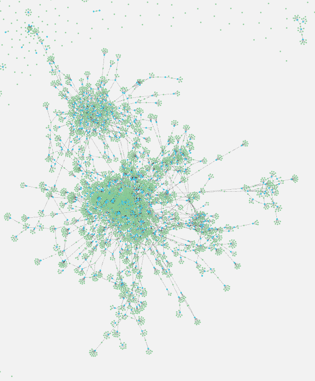

## Introduction to Neo4j
**Neo4j** is an open source, **NoSQL**, **ACID** compliant, native **graph** database.  
Build upon graph theory, it can be an extremely powerful tool on naturally graph data such as social networks.  

For this Introduction, we're going to use a **Netflix** Show data set in the [open data](https://www.kaggle.com/shivamb/netflix-Show?select=netflix_titles.csv) that we extended by scrapping IMDB ratings.
*details in this [notebook](https://github.com/Ismail-Maj/Neo4j/blob/main/notebook.ipynb).*

|      |   show_id | IMDB_id   | type   | title     |   release_year |   rating |   popularity | genres                                          | PG    |   duration |   seasons | director          | date_added      | country                       | cast                                               | description                                        |
|-----:|----------:|:----------|:-------|:----------|---------------:|---------:|-------------:|:------------------------------------------------|:------|-----------:|----------:|:------------------|:----------------|:------------------------------|:---------------------------------------------------|:---------------------------------------------------|
| 3524 |  70131314 | tt1375666 | Movie  | Inception |           2010 |      8.8 |  2.05438e+06 | Action & Adventure, Sci-Fi & Fantasy, Thrillers | PG-13 |        148 |       nan | Christopher Nolan | January 1, 2020 | United States, United Kingdom | Leonardo DiCaprio, Joseph Gordon-Levitt, Ellen Pag | In this mind-bending sci-fi thriller, a man runs a |

*The ids can be used to visit information source.*  
https://www.imdb.com/title/tt1375666  
https://www.netflix.com/title/70131314    

In *Neo4j*, data is stored in a property graph, the units of such graph are nodes and relationships.  

<p align="center">
  
</p>

Each unit contains properties stored as key-value pairs.

```yaml
{
  "title": "Inception",
  "IMDB_id": "tt1375666",
  "show_id": "70131314", 
  "release_year": 2010,
  "duration": 148,
  "date_added": "January 1, 2020",
  "popularity": 2054380,
  "rating": 8.8,
  "description": "In this mind-bending sci-fi thriller..."
}
```

To query such database we need a **G**raph **Q**uery **L**anguage.  
**Cypher** is an open source (*openCypher*) **GQL** created for Neo4j.  
Like **SQL**, it can be used to create, read, update and delete data.   
It's ASCII-art syntax makes it human readable.  

```Cypher
MATCH (p:Person)-[:ACTED_IN]->(n:Show {title:'Inception'}) RETURN p.name
```
[Guide to learn Cypher](https://github.com/adambard/learnxinyminutes-docs/blob/master/cypher.html.markdown)

## Getting started

### Linux
Download Neo4j Desktop from this link https://neo4j.com/download-center/

``` bash
chmod u+x neo4j-desktop-1.3.11-x86_64.AppImage
./neo4j-desktop-1.3.11-x86_64.AppImage
```

Create a new database using GUI and run this [Cypher script](https://github.com/Ismail-Maj/Neo4j/blob/main/init.cql).  
*Some memory tuning might be necessary https://neo4j.com/developer/guide-performance-tuning/*  

## Queries

In this section, we are going to compare Neo4j with  **PostgreSQL** queries by expressivity and performance.  

### Average rating of the netflix database

```SQL
Cypher: 3ms
MATCH (n:Show) RETURN AVG(n);

PSQL: 2ms
SELECT AVG(rating) FROM netflixlibrary;

result: 6.584
```

### Average rating of shows grouped by parental guideline

```SQL
Cypher: 5ms
MATCH (n:Show)-[:GUIDELINE]->(pg:PG) 
RETURN pg, avg(n.rating), count(n) AS avg ORDER BY avg;

PSQL: 4ms
SELECT PG,avg(rating),COUNT(*) FROM netflixlibrary GROUP BY PG ORDER BY PG;

╒═══════════════════╤══════════════════╤══════════╕
│"pg"               │"avg"             │"count(n)"│
╞═══════════════════╪══════════════════╪══════════╡
│{"name":"UR"}      │5.68              │7         │
├───────────────────┼──────────────────┼──────────┤
│{"name":"PG"}      │6.012121212121211 │184       │
├───────────────────┼──────────────────┼──────────┤
│{"name":"G"}       │6.237931034482759 │37        │
├───────────────────┼──────────────────┼──────────┤
│{"name":"TV-Y7"}   │6.310606060606056 │169       │
├───────────────────┼──────────────────┼──────────┤
│{"name":"PG-13"}   │6.4023529411764715│286       │
├───────────────────┼──────────────────┼──────────┤
│{"name":"TV-Y"}    │6.463963963963964 │143       │
├───────────────────┼──────────────────┼──────────┤
│{"name":"R"}       │6.484753363228701 │508       │
├───────────────────┼──────────────────┼──────────┤
│{"name":"TV-Y7-FV"}│6.502666666666667 │95        │
├───────────────────┼──────────────────┼──────────┤
│{"name":"TV-MA"}   │6.575815056312989 │2027      │
├───────────────────┼──────────────────┼──────────┤
│{"name":"TV-14"}   │6.640375260597642 │1698      │
├───────────────────┼──────────────────┼──────────┤
│{"name":"NR"}      │6.695081967213115 │218       │
├───────────────────┼──────────────────┼──────────┤
│{"name":"TV-PG"}   │6.800996677740862 │701       │
├───────────────────┼──────────────────┼──────────┤
│{"name":"TV-G"}    │6.824218750000003 │149       │
├───────────────────┼──────────────────┼──────────┤
│{"name":"NC-17"}   │7.7               │2         │
└───────────────────┴──────────────────┴──────────┘
```

### Average rating of shows grouped by country

```SQL
Cypher: 11ms
MATCH (c:Country)<-[:LOCATION]-(n:Show) 
RETURN c.name AS name, avg(n.rating) AS rating, COUNT(n) as cnt 
ORDER BY cnt

PSQL: 18ms
SELECT TRIM(c_name),avg(rating),count(*)
FROM netflixlibrary net,unnest(string_to_array(net.country, ',')) c_name
GROUP BY c_name ORDER BY avg;

╒══════════════════════╤══════════════════╤═════╕
│"name"                │"rating"          │"cnt"│
╞══════════════════════╪══════════════════╪═════╡
│"United States"       │6.587440656020721 │2610 │
├──────────────────────┼──────────────────┼─────┤
│"India"               │6.347647058823534 │838  │
├──────────────────────┼──────────────────┼─────┤
│"United Kingdom"      │6.909622641509434 │602  │<-
├──────────────────────┼──────────────────┼─────┤
│"Canada"              │6.393617021276598 │318  │
├──────────────────────┼──────────────────┼─────┤
│"France"              │6.611894273127754 │271  │
├──────────────────────┼──────────────────┼─────┤
│"Japan"               │7.166346153846156 │231  │<-
├──────────────────────┼──────────────────┼─────┤
│"Spain"               │6.564137931034486 │178  │
├──────────────────────┼──────────────────┼─────┤
│"South Korea"         │7.05862068965517  │162  │<-
├──────────────────────┼──────────────────┼─────┤
│"Germany"             │6.650359712230215 │151  │
├──────────────────────┼──────────────────┼─────┤
│"Mexico"              │6.554205607476638 │129  │
...
```

### Top 10 netflix shows

```SQL
# with at least 200 popularity
Cypher: 8ms
MATCH (n:Show) WITH n WHERE n.popularity > 200 
RETURN n.title ORDER BY n.rating DESC LIMIT 10

PSQL: 3ms
select title FROM netflixlibrary 
WHERE popularity > 200 ORDER BY rating DESC LIMIT 10;

╒═══════════════════════════════════════════════════════╕
│"Planet Earth II"                                      │
├───────────────────────────────────────────────────────┤
│"Breaking Bad"                                         │
├───────────────────────────────────────────────────────┤
│"Bob Ross: Beauty Is Everywhere"                       │
├───────────────────────────────────────────────────────┤
│"Chill with Bob Ross"                                  │
├───────────────────────────────────────────────────────┤
│"Blue Planet II"                                       │
├───────────────────────────────────────────────────────┤
│"Our Planet"                                           │
├───────────────────────────────────────────────────────┤
│"My Next Guest with David Letterman and Shah Rukh Khan"│
├───────────────────────────────────────────────────────┤
│"Hans Zimmer: Live in Prague"                          │
├───────────────────────────────────────────────────────┤
│"Reply 1988"                                           │
├───────────────────────────────────────────────────────┤
│"The Vietnam War: A Film by Ken Burns and Lynn Novick" │
└───────────────────────────────────────────────────────┘
```
#### top 5

<p align="center">
  
</p>

### Average rating of Ross's film

```SQL

Cypher:1ms
MATCH (bob:Person {name:'Bob Ross'})-[:ACTED_IN]-(n:Show)
RETURN avg(n.rating)

PSQL: 3ms
SELECT avg(rating)
from netflixlibrary net where net.casting like '%Bob Ross%';

result: 9.4
```


### Aaron Paul's co-actors

```SQL
Cypher: 12ms
MATCH (p:Person{name:'Aaron Paul'})-[:ACTED_IN]->(n:Show)<-[:ACTED_IN]-(a:Person) return a.name

PSQL: 4ms
from netflixlibrary net,unnest(string_to_array(net.casting, ',')) name
where net.casting like '%Aaron Paul%' except values('Aaron Paul');
```

### Most famous actors in Netflix

```SQL
Cypher: 4ms
MATCH (p:Person)-[:ACTED_IN]->(n:Show)
RETURN p.name, sum(n.popularity) AS sum ORDER BY sum DESC

PSQL: 65ms
select * from (SELECT TRIM(c_name),sum(popularity)
FROM netflixlibrary net,unnest(string_to_array(net.casting, ',')) c_name
GROUP BY c_name) AS T1 WHERE sum is not null ORDER BY sum;

╒═════════════════════════════╤═══════╕
│"Hugo Weaving"               │5711561│
├─────────────────────────────┼───────┤
│"Leonardo DiCaprio"          │4901110│
├─────────────────────────────┼───────┤
│"Cate Blanchett"             │4836340│
├─────────────────────────────┼───────┤
│"John Rhys-Davies"           │4740712│
├─────────────────────────────┼───────┤
│"Sean Astin"                 │4272762│
├─────────────────────────────┼───────┤
│"Elijah Wood"                │4031570│
├─────────────────────────────┼───────┤
│"Uma Thurman"                │3801823│
├─────────────────────────────┼───────┤
│"Laurence Fishburne"         │3801088│
├─────────────────────────────┼───────┤
│"Orlando Bloom"              │3611498│
├─────────────────────────────┼───────┤
│"Samuel L. Jackson"          │3532007│
├─────────────────────────────┼───────┤
│"Michael Madsen"             │3524795│
├─────────────────────────────┼───────┤
│"Harvey Keitel"              │3342895│
├─────────────────────────────┼───────┤
│"Bernard Hill"               │3218462│
├─────────────────────────────┼───────┤
│"Joseph Gordon-Levitt"       │3174246│
├─────────────────────────────┼───────┤
│"Christopher Walken"         │3151239│
├─────────────────────────────┼───────┤
│"Ian McKellen"               │3113097│
├─────────────────────────────┼───────┤
│"Billy Boyd"                 │3112808│
├─────────────────────────────┼───────┤
│"Viggo Mortensen"            │3112578│
├─────────────────────────────┼───────┤
│"Dominic Monaghan"           │3112578│
├─────────────────────────────┼───────┤
│"Liv Tyler"                  │3112578│
├─────────────────────────────┼───────┤
│"John Travolta"              │3042184│
├─────────────────────────────┼───────┤
│"Keanu Reeves"               │3030949│
...
```

### Popular shows with good rating

```SQL
Cypher: 15ms
MATCH (n:Show) WHERE EXISTS(n.rating) 
WITH n ORDER BY n.popularity DESC LIMIT 200
RETURN n.title ORDER BY n.rating DESC LIMIT 20

PSQL: 5ms
SELECT * FROM 
(SELECT title,rating,popularity FROM netflixlibrary WHERE popularity is not null  ORDER BY popularity DESC LIMIT 200) as T1 
ORDER BY rating DESC LIMIT 20;

╒═══════════════════════════════════════════════╕
│"Breaking Bad"                                 │
├───────────────────────────────────────────────┤
│"Sherlock"                                     │
├───────────────────────────────────────────────┤
│"DEATH NOTE"                                   │
├───────────────────────────────────────────────┤
│"The Office (U.S.)"                            │
├───────────────────────────────────────────────┤
│"Schindler's List"                             │
├───────────────────────────────────────────────┤
│"Friends"                                      │
├───────────────────────────────────────────────┤
│"The Lord of the Rings: The Return of the King"│
├───────────────────────────────────────────────┤
│"Pulp Fiction"                                 │
├───────────────────────────────────────────────┤
│"Peaky Blinders"                               │
├───────────────────────────────────────────────┤
│"Narcos"                                       │
├───────────────────────────────────────────────┤
│"Black Mirror"                                 │
├───────────────────────────────────────────────┤
│"Dark"                                         │
├───────────────────────────────────────────────┤
│"Inception"                                    │
├───────────────────────────────────────────────┤
│"The Matrix"                                   │
├───────────────────────────────────────────────┤
│"Arrested Development"                         │
├───────────────────────────────────────────────┤
│"The Lord of the Rings: The Two Towers"        │
├───────────────────────────────────────────────┤
│"Stranger Things"                              │
├───────────────────────────────────────────────┤
│"House of Cards"                               │
├───────────────────────────────────────────────┤
│"Better Call Saul"                             │
├───────────────────────────────────────────────┤
│"The Seven Deadly Sins"                        │
└───────────────────────────────────────────────┘
```

### infamous shows in Netflix

```SQL
Cypher: 10ms
MATCH (n:Show) WHERE EXISTS(n.rating) 
WITH n ORDER BY n.popularity DESC LIMIT 200
RETURN n.title ORDER BY n.rating LIMIT 10

PSQL: 2ms
SELECT * FROM 
(SELECT title,rating,popularity FROM netflixlibrary WHERE popularity is not null  ORDER BY popularity DESC LIMIT 200) as T1 
ORDER BY rating LIMIT 10;

╒════════════════════════════════════════════════════╕
│"Ghost Rider"                                       │
├────────────────────────────────────────────────────┤
│"Clash of the Titans"                               │
├────────────────────────────────────────────────────┤
│"The Tourist"                                       │
├────────────────────────────────────────────────────┤
│"Superman Returns"                                  │
├────────────────────────────────────────────────────┤
│"Die Another Day"                                   │
├────────────────────────────────────────────────────┤
│"Indiana Jones and the Kingdom of the Crystal Skull"│
├────────────────────────────────────────────────────┤
│"Men in Black II"                                   │
├────────────────────────────────────────────────────┤
│"How the Grinch Stole Christmas"                    │
├────────────────────────────────────────────────────┤
│"Spider-Man 3"                                      │
├────────────────────────────────────────────────────┤
│"Knowing"                                           │
└────────────────────────────────────────────────────┘
```

### Aaron paul's co-actors and co-actors's co-actors recursively

```SQL
Cypher: 348ms
MATCH (a:Person {name:"Aaron Paul"})-[:ACTED_IN* 1..12]-(o:Person) 
RETURN count(DISTINCT o)

PSQL: 38200ms
WITH RECURSIVE subordinates AS (
        	SELECT DISTINCT TRIM(name) 
		   	 FROM netflixlibrary net,unnest(string_to_array(net.casting, ',')) name 
		   	 WHERE net.casting like '%Aaron Paul%' except values('Aaron Paul') 
        UNION
		SELECT DISTINCT TRIM(name)
		   	 FROM subordinates sub, netflixlibrary net,unnest(string_to_array(net.casting, ',')) name 
		   	 WHERE net.casting like '%' || sub.btrim || '%'
) 
SELECT count(*)
FROM subordinates;

result: 26258 out of 27405 actors
```

### Shortest Path from Dicapprio to Reeves

```SQL
Cypher: 2ms
MATCH p=shortestPath(
(bacon:Person {name:"Leonardo DiCaprio"})-[:ACTED_IN*]-(meg:Person {name:"Keanu Reeves"})
)
RETURN p

PSQL: ???
```

<p align="center">
  
</p>

### Analysis

As we've seen, PSQL runs up against major performance challenges when it tries to navigate connected data, this is mostly due to the expensive cost of joins.  

PSQL queries not only take more time to run, but they also take more time to write and understand.  
Its inherent complexity will eventually lead to coding mistakes and bad maintainability.  

On top of that, Neo4j offers great visualization tools and interactive manipulation which is highly valuable to data scientists and researchers.

But this comes at a hefty price, Neo4j is a memory hog.

SQL as we've seen in the benchmarks, still benefits from optimization and stability due to being the standard for so long.  
When exploration and complex-joins are not a concern, SQL still dominates NoSQL counterparts.

### Page Rank

PageRank is the first algorithm used by Google to rank search engine.
We're going to use it to evaluate a person's importance in the industry.

The underlying assumption of PageRank is that a Person is more important if it has many relationships with important nodes.

```SQL

CALL gds.graph.create('project', ['Person','Show'], {
	ACTED_IN: {
    	orientation: 'UNDIRECTED'
    },
    DIRECTED: {
    	orientation: 'UNDIRECTED'
    }
})

CALL gds.pageRank.stream('project') YIELD nodeId, score
WITH gds.util.asNode(nodeId) AS node, score
WHERE node:Person
RETURN node.name, score
ORDER BY score DESC LIMIT 10

╒════════════════════╤═════════════════╕
│"node.name"         │"score"          │
╞════════════════════╪═════════════════╡
│"David Attenborough"│7.7568895956676  │
├────────────────────┼─────────────────┤
│"Anupam Kher"       │6.354905666736885│
├────────────────────┼─────────────────┤
│"Shah Rukh Khan"    │5.878990030821296│
├────────────────────┼─────────────────┤
│"Naseeruddin Shah"  │5.812050463556079│
├────────────────────┼─────────────────┤
│"Jan Suter"         │5.752281660877633│

```


```SQL
#weighted page rank
CALL gds.graph.create.cypher(
    'proj',
    'MATCH (n) WHERE n:Person OR n:Show  RETURN id(n) AS id',
    'MATCH (a:Person)-[:ACTED_IN]-(b:Show) RETURN id(b) AS source, id(a) AS target, b.rating*b.popularity as weight'
);

MATCH (attack:Person)-[:ACTED_IN]->(c:Show) 
WITH collect(c) AS sourceNodes
call gds.pageRank.stream('proj', {
	sourceNodes: sourceNodes,
    relationshipWeightProperty: 'weight'
})
YIELD nodeId, score
WHERE score > 0
RETURN gds.util.asNode(nodeId).name AS name, score
ORDER BY score DESC

╒════════════════════════╤═══════════════════╕
│"name"                  │"score"            │
╞════════════════════════╪═══════════════════╡
│"David Attenborough"    │2.0399998784065247 │
├────────────────────────┼───────────────────┤
│"Samuel West"           │1.1806825994513928 │
├────────────────────────┼───────────────────┤
│"Jeff Dunham"           │0.9881249569356442 │
├────────────────────────┼───────────────────┤
│"Craig Sechler"         │0.7649999797344208 │
├────────────────────────┼───────────────────┤
│"Bill Burr"             │0.663000026345253  │
```

### Bloom

Bloom is a code-free data visualization tool.

<p align="center">
  
</p>

<p align="center">
  
</p>

We can infere from this visualization that there is a big cluster in the middle of actors directors and movies that could represent "Hollywood".


